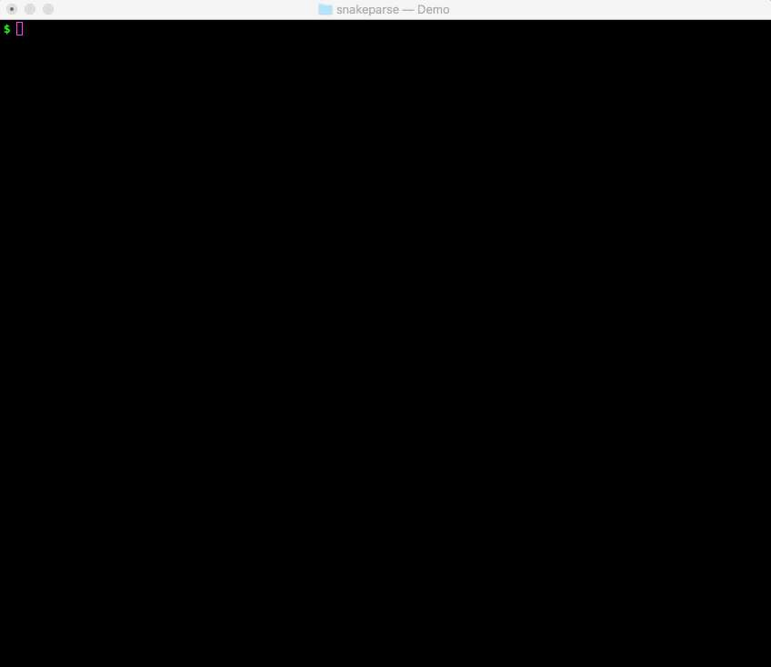

==========
Snakeparse
==========

:Author: Nils Homer
:Date: |today|
:Version: |version|

Making `Snakemake <https://bitbucket.org/snakemake/snakemake>`_ workflows into full-fledged command line tools since 1999.

Documentation Contents
========

.. toctree::
   :maxdepth: 1

   api.rst
   usage.rst
   installation.rst
   release.rst

Why Snakeparse?
===============

- I wanted a single command line utility that could organize and execute multiple Snakemake workflows
- I wanted to have my workflow-specific arguments be parsed on the command line (ex. with `argparse <https://docs.python.org/3/library/argparse.html>`_)
- I wanted an API or library to configure how to group and organize the workflows, and how to display them on the command line.
- I didn't want to write this library more than once.

Demo
====

Installation
============

To install the latest release, type::

    git clone https://github.com/nh13/snakeparse.git
    python setup.py install

See the :ref:`Installation notes <installation>` for details.

.. _installation

Indices and tables
------------------

Contents:

* :ref:`genindex`
* :ref:`modindex`
* :ref:`search`

.. _references

References
----------

.. seealso::

   Snakemake
      http://snakemake.readthedocs.io

   The python language
      http://www.python.org
